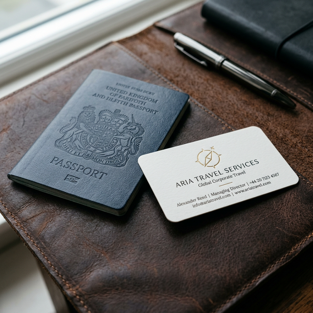

# Sua agência é uma empresa ou apenas um hobby que gasta seu tempo?

Essa é uma pergunta difícil de ouvir, mas necessária.

Dono de empresa foca em **lucro e escala**. 
Dono de hobby foca em **tarefas operacionais que não trazem resultado**.

Se você passa 3 horas por dia no Canva tentando criar um post "perfeitinho" que gera zero pedidos de orçamento, você está tratando o marketing da sua agência como um hobby criativo, não como um braço de vendas.

### A Segunda Visão da Sua Gestão

Pense logicamente: seu tempo é a sua moeda mais valiosa.
- Se o seu fee ou sua comissão por venda é de, digamos, R$ 500.
- E você gasta 10 horas por mês criando conteúdo do zero.
- Você está "gastando" R$ 5.000 de potencial de faturamento em design.

Seria mais lucrativo usar esse tempo para ligar para 10 ex-clientes e oferecer uma nova viagem? Com certeza.

### O Divisor de Águas
Empresas lucrativas usam SISTEMAS. Elas não reinventam a roda todo dia. Elas pegam o que funciona, aplicam e focam no fechamento das vendas.

Marketing não deve ser o seu trabalho principal. O seu trabalho é vender viagem. O marketing deve ser o motor que traz os leads.

---

**[WEBINAR]** Descubra como profissionalizar seu marketing e recuperar suas horas livres na **Aula Secreta: O Mapa da Agência 5 Estrelas** (18/03).

👉 [**Garanta sua vaga aqui**](file:///c:/Users/win%2010/Desktop/agencias-viagem/webnar/landing-page/index.html)
