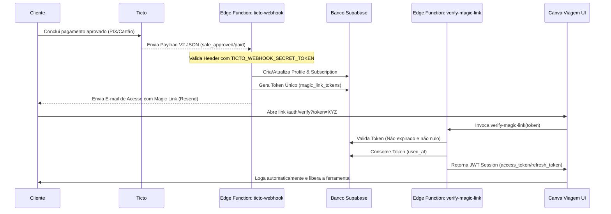

# 🔗 Integração Ticto Checkout — Canva Viagem

**Status:** Concluído e Em Produção (Junho/2026)
**Objetivo:** Permitir vendas automatizadas e seguras através da plataforma Ticto sem interferir na infraestrutura Stripe/AbacatePay já existente.

---

## 🛠️ Arquitetura Técnica

A integração funciona de forma assíncrona baseada em eventos (Webhooks) processados no lado do servidor e validados no frontend.

---

## 💻 Arquivos e Funções Envolvidos

### 1. Servidor (Edge Functions)
* **`supabase/functions/ticto-webhook`**:
  * **Função**: Ponto de entrada do webhook da Ticto.
  * **Segurança**: Valida o header `authorization` contra a variável de ambiente `TICTO_WEBHOOK_SECRET_TOKEN`.
  * **Mapeamento de Planos Inteligente**: Lê o nome do produto vendido (`productName`) e mapeia programaticamente:
    * Se contiver `"start"` (case insensitive) ➔ define `productId` como `"start_ticto"`.
    * Se contiver `"elite"` (case insensitive) ➔ define `productId` como `"elite_ticto"`.
* **`supabase/functions/verify-magic-link`**:
  * **Função**: Valida o token e cria a sessão de autenticação do usuário.
  * **Segurança contra Prefetch**: Permite reuso do token de login durante todo o seu período de validade (1h), evitando que scanners de e-mail (antivírus de e-mail que pré-clicam em links) inutilizem o link de acesso do cliente antes de ele de fato clicar.

### 2. Frontend (Regras de Acesso e Gating)
A validação de níveis (**Elite** vs **Start**) no frontend foi unificada para suportar Stripe, AbacatePay e Ticto dinamicamente, sem necessidade de hardcodear listas de IDs.
* **Fórmula de Classificação de Tiers**:
  * `isStart` ➔ Assinante ativo cujo `product_id` contenha `"start"`, `"smart"` ou `"basic"`.
  * `isElite` ➔ Assinante ativo cujo `product_id` **NÃO** seja um plano Start.
* **Componentes Ajustados**:
  * `src/components/ProtectedRoute.tsx`: Protege as rotas privadas `/fabrica` e `/painel-marketing` para membros Elite.
  * `src/pages/Fabrica.tsx` e `FabricaES.tsx`: Gatam o Gerador de Mídias e Criador de Sites, exibindo o checkout e bloqueio para membros Start/Gratuitos e liberando acesso total para membros Elite.
  * `src/components/Header.tsx`: Exibe/oculta o link da Fábrica no menu superior dependendo do nível de acesso.
  * `src/components/canva/BottomNav.tsx`: Protege o atalho de rodapé da Fábrica. *(Nota: Corrigido também o encapsulamento JSX do modal de upgrade em espanhol/português)*.

---

## ⚙️ Configurações Exigidas no Painel da Ticto

Para garantir que o fluxo funcione no automático, os seguintes campos devem estar preenchidos no painel da Ticto para o produto:

1. **URL de acesso (Área de membros via webhook)**:
   `https://canvaviagem.com/auth`
2. **Webhook de Integração**:
   * **URL**: `https://zdjtcwtakgizbsbbwtgc.supabase.co/functions/v1/ticto-webhook`
   * **Eventos**: Ativar para `Venda Aprovada (sale_approved)` e `Assinatura Ativa`.
3. **URL de Obrigado (Thank You Page)**:
   `https://canvaviagem.com/obrigado`

---

## 🔒 Variáveis de Ambiente Necessárias (Supabase Dashboard)

* `TICTO_WEBHOOK_SECRET_TOKEN`: Token secreto fornecido pela Ticto para assinar e validar a segurança dos payloads de Webhooks.
* `RESEND_API_KEY`: Chave de API da Resend para disparo dos e-mails transacionais com o Magic Link de login.
